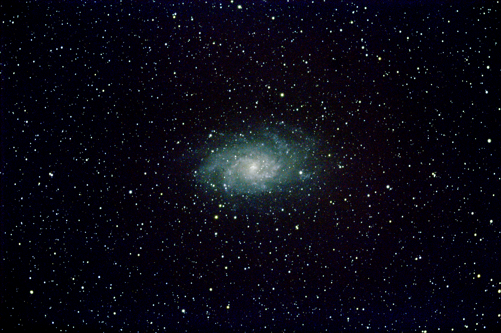

# Astro
Place to hold Astro data

I will store raw CR2 files and my initial process of them here.

These were my very first captures, during my first month, (starting with M13) using SV503 80ED on an iEXOS 100 PMC8 with a Canon 600D camera guided by an SV165 30/120 and SV305 camera

M13 Hercules Cluster = 8 * 3mins = 24 mins

M27 Dumbbell Nebula = 6 * 3mins = 18 mins

M31 Andromeda Galaxy = 10 * 3mins = 30 mins

M33 Triangulum Galaxy = 20 * 5mins = 100 mins

Veil Nebula = 23 * 4mins  = 92 mins

Then the following in October/November (23) - just processed results - no subs and no info about integration times:

Horsehead and Flame Nebulae

Orion Nebula (M42)

Pleiades (M45)

Triangulum Galaxy (M33)

